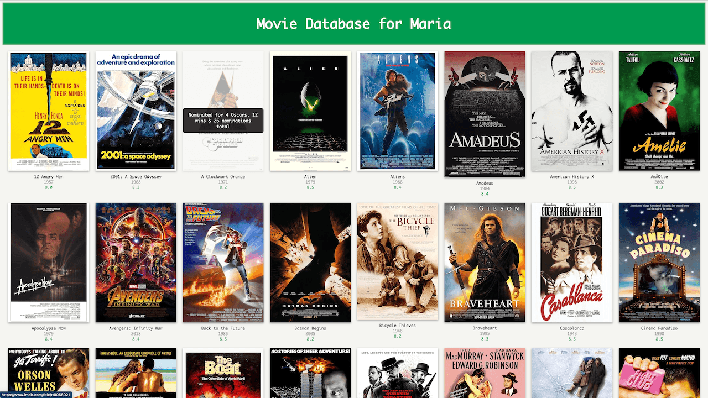

# Movie Database Project


A modern Python-based movie database application for managing, analyzing, and exploring movie collections.

The project combines:

- API integration
- SQLite storage
- JSON persistence
- website generation
- analytics
- fuzzy search
- and multi-user support

inside a clean and extensible Python architecture.

The application is designed both as:

- a practical learning project
- and a reusable Python project template for future applications.

---

# Screenshot

Generated Movie Website



---

# Features

- CRUD functionality (Create, Read, Update, Delete)
- Movie analytics:
  - top-rated movies
  - least-rated movies
  - statistics and rankings
- Nested movie data structures
- Persistent JSON storage
- SQLite database integration
- Automatic movie data fetching from external APIs
- Website generation with:
  - movie posters
  - IMDb links
  - hover effects
  - responsive layout
- Personalized multi-user movie collections
- Intelligent fuzzy movie search
- Detailed movie information pages
- Logging and configuration management
- Modular Python project structure
- Unit tests and smoke tests
- Environment variable support via `.env`
- Extensible architecture for future frameworks and features

And much more.

---

# Tech Stack

- Python
- SQLite
- SQLAlchemy
- Requests
- HTML / CSS
- Matplotlib
- OMDb API

---

# Architecture

The project is separated into multiple layers:

- API layer
- Storage layer
- Website generation layer
- Helper utilities
- Export layer

The application supports both:

- JSON-based persistence
- and SQLite database storage

to demonstrate different storage approaches.

---

# Screenshots

## Generated Movie Website

Add screenshots here later:

```text
docs/screenshots/movie_website.png
```

---

# Project Structure

```text
project/
│
├── README.md
├── api
│   └── omdb_api.py
├── .env.example
├── data
│   ├── blockbusters.py
│   ├── exports
│   │   ├── index.html
│   │   ├── movie_histogram.png
│   │   └── style.css
│   ├── movies.db
│   └── movies.json
├── helpers
│   └── display_formats.py
├── movie_db.py
├── movie_storage
│   ├── movie_storage_json.py
│   └── movie_storage_sql.py
├── requirements.txt
├── templates
│   └── index_template.html
└── website.py
```

---

# Installation

Clone the repository and install the required dependencies.

## Clone Repository

```bash
git clone <repository-url>
cd <project-folder>
```

---

## Install Dependencies

All required Python packages are listed in `requirements.txt`.

Install them with:

```bash
pip install -r requirements.txt
```

---

# Environment Variables

The OMDb API requires authentication.

Create a local `.env` file:

```env
API_KEY=YOUR_API_KEY
```

---

# Run the Application

Start the project with:

```bash
python movie_db.py
```

or depending on your system:

```bash
python3 movie_db.py
```

---

# Output

After execution, the generated website will be available locally.

Open the following file in your browser:

```text
./data/exports/index.html
```

---

# Example Workflow

After starting the application, the user selects or creates a personal movie collection profile.

Example:

```text
Select user:
0. Create new user
1. Alice
2. Bob

> Alice selected
```

The selected user now works inside their own personalized movie environment.

---

## Example Session

### 1. List Movies

```text
Choose option: 1
```

Example output:

```text
Interstellar (2014) - Rating: 8.7
Inception (2010) - Rating: 8.8
```

---

### 2. Add Movies

```text
Choose option: 2
Movie title: Interstellar
```

The application automatically:

- fetches movie data from the API
- downloads ratings and poster URLs
- stores the movie in SQLite
- assigns the movie to the selected user

---

### 3. Search Movies

```text
Choose option: 7
Search: inter
```

The application supports intelligent fuzzy movie searching.

---

### 4. Show Movie Details

```text
Choose option: 12
Movie: Interstellar
```

Detailed information includes:

- Title
- Year
- Rating
- Poster
- IMDb link
- Additional metadata
- Awards

---

### 5. Analytics and Statistics

```text
Choose option: 5
```

Example statistics:

- highest-rated movie
- lowest-rated movie
- average rating
- total movie count

---

### 6. Rating Histogram

```text
Choose option: 9
```

A histogram visualization of movie ratings is generated.

---

### 7. Generate Website

```text
Choose option: 10
```

The application generates a complete movie website including:

- movie posters
- IMDb links
- hover effects
- responsive movie grid
- personalized user collections

Generated output:

```text
exports/index.html
```

---

### 8. Random Movie Recommendation

```text
Choose option: 6
```

The application selects a random movie from the user's collection.

---

### 9. Update or Delete Movies

```text
Choose option: 4
Choose option: 3
```

Users can modify or remove movies from their collections.

---

### 10. Fill Database with Blockbusters

```text
Choose option: 11
```

The application automatically imports a predefined blockbuster movie collection via API requests.

---

### 11. Exit Application

```text
Choose option: 0
```

The application closes safely and all data remains persistently stored.

---

# Future Improvements

Possible future extensions:

- Flask or FastAPI integration
- User authentication
- Watchlists and favorites
- Movie recommendations
- Docker support
- CI/CD pipelines
- Cloud deployment
- Advanced analytics dashboard

---

# License

Released under the MIT License.

This project is intended for educational and learning purposes.